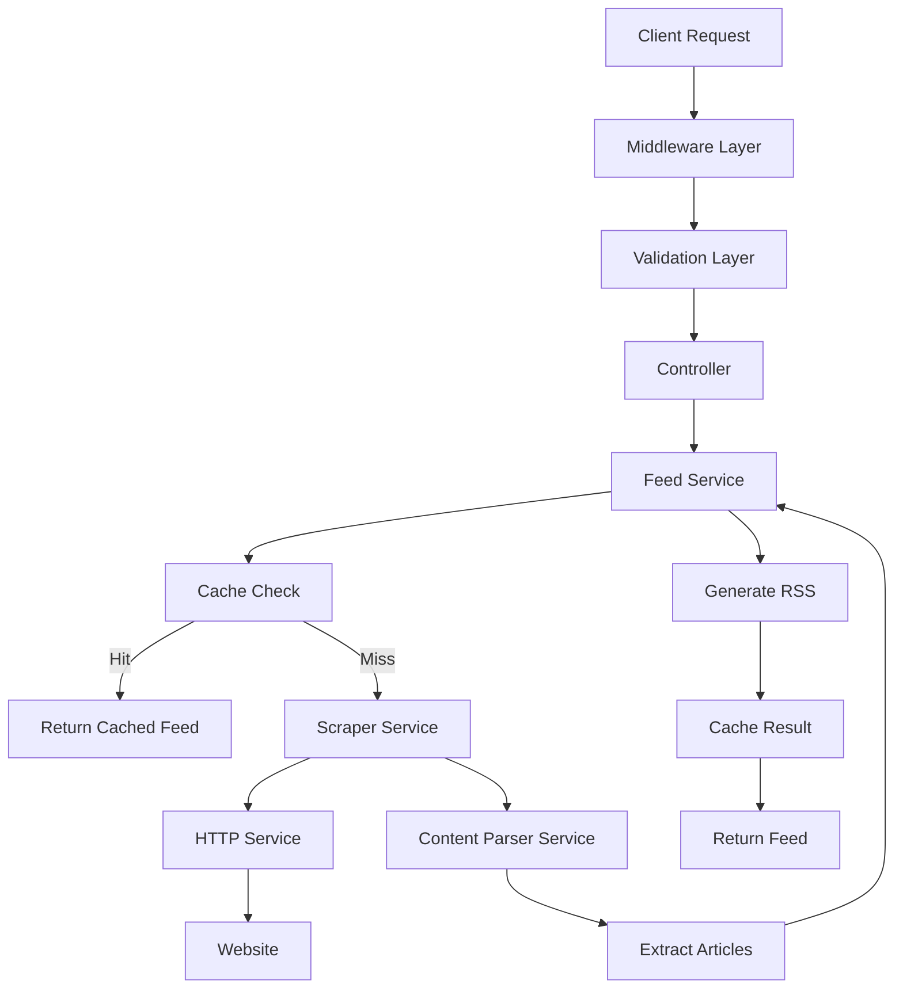

# RSS Feed Generator

> 🚀 **Professional-grade RSS feed generator** that creates RSS feeds from any website with enhanced error handling, caching, and monitoring.

[](https://nodejs.org/)
[](https://opensource.org/licenses/MIT)
[](http://makeapullrequest.com)

## ✨ Features

### 🔧 Core Functionality
- **Automatic Content Extraction**: Intelligently extracts articles from any website
- **RSS 2.0 Compatible**: Generates valid RSS feeds that work with all feed readers
- **Site-Specific Rules**: Optimized extraction for popular websites (VnExpress, TechCrunch, etc.)
- **Custom Feed Metadata**: Customizable titles, descriptions, and categories

### 🛡️ Enterprise-Ready
- **Enhanced Security**: Rate limiting, input validation, XSS protection
- **Comprehensive Error Handling**: Custom error classes with detailed context
- **Advanced Caching**: Intelligent caching with LRU cleanup and expiration
- **Structured Logging**: Request tracking with unique IDs and performance metrics
- **Health Monitoring**: Real-time health checks and system statistics

### 🔍 Developer Experience
- **Validation Layer**: Comprehensive input validation with detailed error messages
- **API Documentation**: Auto-generated OpenAPI spec and interactive docs
- **Debugging Tools**: Preview endpoints and debug information
- **Graceful Shutdown**: Proper cleanup and final reports

## 🚀 Quick Start

### Prerequisites
- Node.js >= 16.0.0
- npm >= 8.0.0

### Installation

1. **Clone the repository**
   ```bash
   git clone https://github.com/your-repo/rss-feed-generator.git
   cd rss-feed-generator
   ```

2. **Install dependencies**
   ```bash
   npm install
   ```

3. **Setup environment**
   ```bash
   npm run setup
   ```

4. **Start development server**
   ```bash
   npm run dev
   ```

5. **Test the API**
   ```bash
   # Health check
   curl http://localhost:3000/health

   # Generate your first RSS feed
   curl "http://localhost:3000/feed?url=https://vnexpress.net"
   ```

## 📖 API Reference

### Core Endpoints

#### Generate RSS Feed
```http
GET /feed?url=<website_url>&title=<custom_title>&description=<custom_desc>&limit=<number>
```

**Parameters:**
- `url` (required): Website URL to generate feed from
- `title` (optional): Custom feed title (max 100 chars)
- `description` (optional): Custom feed description (max 500 chars)
- `limit` (optional): Number of articles (1-50, default: 20)

**Example:**
```bash
curl "http://localhost:3000/feed?url=https://vnexpress.net&title=VnExpress%20News&limit=10"
```

#### Preview Articles
```http
GET /preview?url=<website_url>&limit=<number>&page=<page>
```

**Example:**
```bash
curl "http://localhost:3000/preview?url=https://techcrunch.com&limit=5"
```

#### Get Metadata
```http
GET /metadata?url=<website_url>
```

**Example:**
```bash
curl "http://localhost:3000/metadata?url=https://github.blog"
```

#### Validate Website
```http
POST /validate
Content-Type: application/json

{
  "url": "https://example.com"
}
```

### System Endpoints

#### Health Check
```http
GET /health
```
Returns comprehensive system status including memory usage, cache statistics, and performance metrics.

#### Cache Management
```http
GET /cache/stats          # Get cache statistics
DELETE /cache             # Clear all cache
DELETE /cache?url=<url>   # Clear cache for specific URL
```

#### API Documentation
```http
GET /api/info            # Detailed API documentation
GET /openapi.json        # OpenAPI 3.0 specification
```

## 🏗️ Architecture

### Project Structure
```
src/
├── controllers/         # Request handlers
│   └── feedController.js
├── services/           # Business logic
│   ├── feedService.js     # RSS generation
│   ├── scraperService.js  # Web scraping orchestration
│   ├── httpService.js     # HTTP client
│   └── contentParserService.js  # HTML parsing
├── middleware/         # Express middleware
│   └── index.js
├── validators/         # Input validation
│   └── index.js
├── errors/            # Custom error classes
│   └── index.js
├── utils/             # Utility functions
│   └── helpers.js
└── routes/            # API routes
    └── index.js

config/                # Configuration
scripts/               # Setup and utility scripts  
tests/                 # Test suites
```

### Service Architecture



## ⚙️ Configuration

### Environment Variables

Create a `.env` file (automatically created by setup script):

```bash
# Server Configuration
PORT=3000
NODE_ENV=development
BASE_URL=http://localhost:3000

# Application Settings
CACHE_DURATION=3600          # Cache duration in seconds
MAX_ARTICLES_PER_FEED=20     # Maximum articles per feed
REQUEST_TIMEOUT=10000        # Request timeout in milliseconds

# Security
RATE_LIMIT_WINDOW=900000     # Rate limit window (15 minutes)
RATE_LIMIT_MAX=100           # Max requests per window

# Scraping Settings
USER_AGENT=Mozilla/5.0 (Windows NT 10.0; Win64; x64) AppleWebKit/537.36
```

### Site-Specific Rules

The content parser includes optimized rules for popular websites:

```javascript
// Example: Adding custom rules for a new site
contentParserService.addSiteRules('example.com', {
  articleSelector: '.post',
  titleSelector: '.post-title',
  linkSelector: '.post-title a',
  descriptionSelector: '.post-excerpt',
  imageSelector: '.post-image img',
  dateSelector: '.post-date'
});
```

## 🔧 Development

### Available Scripts

```bash
npm run dev              # Start development server with hot reload
npm run test             # Run test suite
npm run lint             # Check code style
npm run lint:fix         # Fix code style issues
npm run setup            # Initialize project
npm run production       # Start production server with clustering
npm run health-check     # Check if server is running
npm run cache:clear      # Clear all cache
npm run monitor          # Watch server health in real-time
```

### Adding Custom Extractors

1. **Add site rules** in `contentParserService.js`:
   ```javascript
   this.siteRules['your-site.com'] = {
     articleSelector: '.article',
     titleSelector: '.title',
     // ... other selectors
   };
   ```

2. **Test your extractor**:
   ```bash
   curl "http://localhost:3000/preview?url=https://your-site.com&limit=3"
   ```

### Testing

```bash
# Run all tests
npm test

# Run with coverage
npm run test:coverage

# Test specific functionality
node tests/examples.js --examples
```

## 🚀 Production Deployment

### Using PM2

1. **Install PM2**:
   ```bash
   npm install -g pm2
   ```

2. **Start with PM2**:
   ```bash
   pm2 start ecosystem.config.js
   ```

3. **Monitor**:
   ```bash
   pm2 status
   pm2 logs rss-generator
   pm2 monit
   ```

### Docker Deployment

```dockerfile
FROM node:18-alpine
WORKDIR /app
COPY package*.json ./
RUN npm ci --only=production
COPY . .
EXPOSE 3000
CMD ["npm", "start"]
```

```bash
docker build -t rss-generator .
docker run -p 3000:3000 -e NODE_ENV=production rss-generator
```

### Environment Setup

```bash
# Production environment variables
NODE_ENV=production
PORT=3000
BASE_URL=https://your-domain.com

# Optional: Redis for distributed caching
REDIS_URL=redis://localhost:6379

# Optional: Winston for structured logging
LOG_LEVEL=info
LOG_FILE=logs/app.log
```

## 📊 Monitoring

### Health Endpoints

- `GET /health` - Comprehensive health check
- `GET /ping` - Simple ping check
- `GET /cache/stats` - Cache performance metrics

### Metrics Available

- **System**: Memory usage, uptime, CPU
- **Application**: Request count, error rate, response times
- **Cache**: Hit rate, size, cleanup statistics
- **Scraping**: Success rate, average response time

### Sample Health Response

```json
{
  "status": "healthy",
  "timestamp": "2024-01-15T10:30:00.000Z",
  "system": {
    "uptime": 3600,
    "memory": {
      "used": 45,
      "total": 128,
      "percentage": 35
    }
  },
  "services": {
    "scraper": {
      "status": "operational",
      "stats": {
        "successRate": 95,
        "totalRequests": 150
      }
    }
  }
}
```

## 🛠️ Troubleshooting

### Common Issues

#### High Memory Usage
```bash
# Check memory stats
curl http://localhost:3000/cache/stats

# Clear cache if needed
curl -X DELETE http://localhost:3000/cache
```

#### Rate Limiting Issues
```bash
# Check rate limit headers
curl -I http://localhost:3000/health

# Current limits: 100 requests per 15 minutes
```

#### Scraping Failures
```bash
# Test website accessibility
curl -X POST http://localhost:3000/validate \
  -H "Content-Type: application/json" \
  -d '{"url": "https://problematic-site.com"}'

# Check debug information
curl "http://localhost:3000/debug/extract?url=https://site.com"
```

### Error Codes

| Code | Description | Solution |
|------|-------------|----------|
| `VALIDATION_ERROR` | Invalid input parameters | Check API documentation |
| `SCRAPING_ERROR` | Failed to fetch website | Check URL accessibility |
| `NO_ARTICLES_FOUND` | No articles extracted | Site may not be supported |
| `RATE_LIMIT_EXCEEDED` | Too many requests | Wait and retry |
| `TIMEOUT_ERROR` | Request timeout | Site may be slow |

## 🤝 Contributing

1. **Fork the repository**
2. **Create a feature branch**: `git checkout -b feature/amazing-feature`
3. **Make your changes** and add tests
4. **Run the test suite**: `npm test`
5. **Commit your changes**: `git commit -m 'Add amazing feature'`
6. **Push to the branch**: `git push origin feature/amazing-feature`
7. **Open a Pull Request**

### Development Guidelines

- Follow ESLint configuration
- Add tests for new features
- Update documentation
- Ensure all tests pass
- Use conventional commit messages

## 📄 License

This project is licensed under the MIT License - see the [LICENSE](LICENSE) file for details.

## 🙏 Acknowledgments

- [Cheerio](https://cheerio.js.org/) for HTML parsing
- [Axios](https://axios-http.com/) for HTTP requests
- [Express](https://expressjs.com/) for the web framework
- [RSS](https://www.npmjs.com/package/rss) for RSS generation

## 📞 Support

- **Documentation**: [API Info Endpoint](http://localhost:3000/api/info)
- **Issues**: [GitHub Issues](https://github.com/your-repo/rss-feed-generator/issues)
- **Discussions**: [GitHub Discussions](https://github.com/your-repo/rss-feed-generator/discussions)

---

**Made with ❤️ for the RSS community**